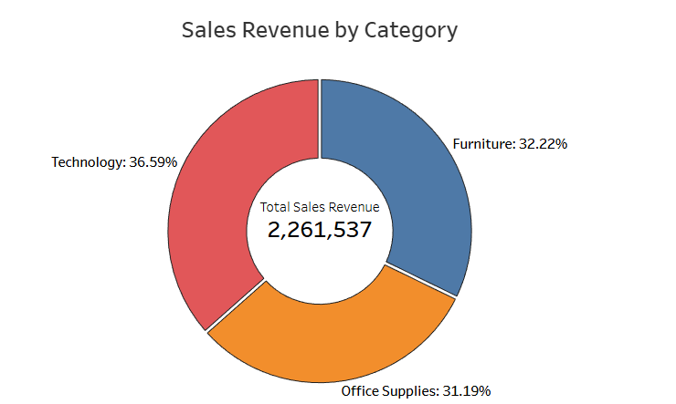
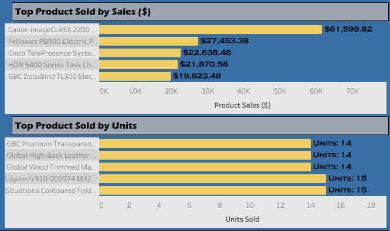
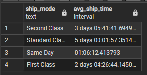
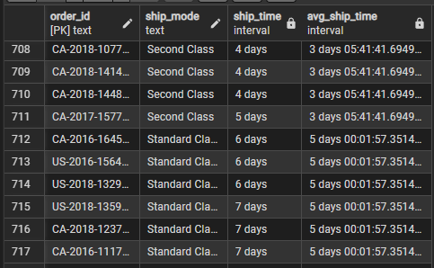
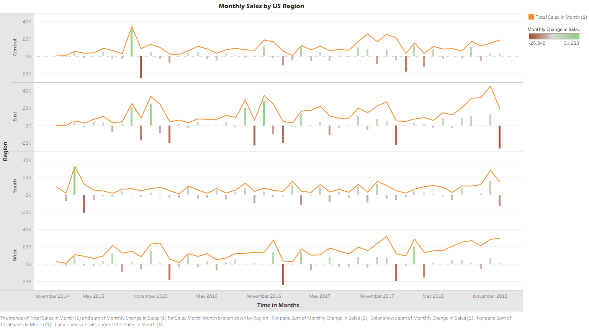
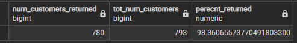
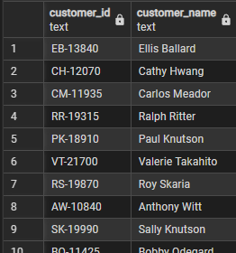
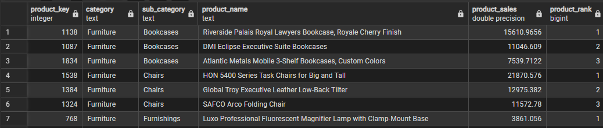

# sales-modeling
This project analyzes a sales dataset from Kaggle. The dataset is normalized into a PostgreSQL database, and is used to answer a set of 10 business related questions. Tableau was used to help visualize some of the data generated by the SQL outputs.

**Tech Stack:** PostgreSQL, Python, Tableau

## Dataset

The dataset used for analysis is the [Superstore Sales Dataset](https://www.kaggle.com/datasets/rohitsahoo/sales-forecasting) by Rohit Sahoo on Kaggle. It contains retail sales data of a global superstore from 2015 through 2017. Each entry contains information on the order placed including customer and product information.

## Preprocessing / Database Setup

*Python* //
On setting up the Postgres database, the initial data set present a few issues. Namely the date formats were incorrect and the product name column contained a series of commas, apostrophes, and quotes. This was handled using a Pandas dataframe in [01_raw_load.py](./scripts/01_raw_load.py).

*SQL* //
Once the raw data was loaded into Postgres, it was divided into seperate tables for orders, products, and customer information respectively. The products had some duplicated product IDs for distinct items, so a seperate product key was created internally to identify the items. The SQL script to setup the schema is [02_schema_normalization](./scripts/02_schema_normalization.sql).

*Entity Relationship Diagram (ERD)*


## Questions and Visualization

The respective SQL script is [03_question_queries](./scripts/03_question_queries.sql).

The final dashboard on Tableau Public [here](https://public.tableau.com/views/SalesModelingProject/Dashboard1?:language=en-US&publish=yes&:sid=&:redirect=auth&:display_count=n&:origin=viz_share_link).

### What is the overall sales revenue from the entire dataset?

```sql
SELECT SUM(sales) FROM order_items
```

### What percentage of total sales does each category (Furniture, Office Supplies, Tech) represent?

```sql
SELECT 
	p.category, 
	SUM(oi.sales) AS tot_cat_sales,
	SUM(oi.sales) / SUM(SUM(oi.sales)) OVER () AS percent
FROM order_items oi
JOIN products p ON p.product_key = oi.product_key
GROUP BY p.category
```

**Visual:**



### Who are the top 10 customers by total sales, and what is their total contribution?

```sql
SELECT o.customer_id, c.customer_name, SUM(oi.sales) AS customer_sales
FROM order_items oi
JOIN orders o ON o.order_id = oi.order_id
JOIN customers c ON c.customer_id = o.customer_id
GROUP BY o.customer_id, c.customer_name
ORDER BY customer_sales DESC
LIMIT 10
```

**Visual:**


### What are the top 5 best selling products?

```sql
-- Best Selling by Sales Total
SELECT p.product_key, p.product_id, p.product_name, 
	SUM(oi.sales) AS product_sales, 
	COUNT(oi.order_id) AS num_units_sold
FROM order_items oi
JOIN products p ON p.product_key = oi.product_key
GROUP BY p.product_key
ORDER BY product_sales DESC, num_units_sold DESC
LIMIT 5

-- Best Selling by Quantity Sold
SELECT p.product_key, p.product_id, p.product_name, 
	SUM(oi.sales) AS product_sales, 
	COUNT(oi.order_id) AS num_units_sold
FROM order_items oi
JOIN products p ON p.product_key = oi.product_key
GROUP BY p.product_key
ORDER BY num_units_sold DESC, product_sales DESC
LIMIT 5
```

**Visual:**



### What is the average shipping time by ship mode?

```sql
SELECT ship_mode, AVG(ship_date - order_date) AS avg_ship_time
FROM orders
GROUP BY ship_mode
```

**Output:**



### Which orders shipped later than average with respect to the ship mode?

```sql
WITH ship_calculations AS (
	SELECT order_id, ship_mode, 
		ship_date - order_date AS ship_time,
		AVG(ship_date - order_date) OVER (PARTITION BY ship_mode) AS avg_ship_time
	FROM orders
)
SELECT * FROM ship_calculations
WHERE ship_time > avg_ship_time
```

**Output:**



### How do sales fluctuate monthly accross different regions?

```sql
WITH monthly_summary AS (
	SELECT 
		region,
		EXTRACT(YEAR FROM order_date) AS sales_year,
		EXTRACT(MONTH FROM order_date) AS sales_month, 
		SUM(sales) AS tot_month_sales
	FROM order_items oi
	JOIN orders o ON o.order_id = oi.order_id
	GROUP BY region, sales_year, sales_month
	ORDER BY sales_year, sales_month, region
)
SELECT *, 
	tot_month_sales - LAG(tot_month_sales) OVER (
		PARTITION BY region 
		ORDER BY sales_year, sales_month
	) AS monthly_change_in_sales
FROM monthly_summary
GROUP BY region, sales_year, sales_month,tot_month_sales
ORDER BY sales_year, sales_month, region
```

**Visual:**



### What percentage of your customer base has ordered more than once?

```sql
WITH customer_counts AS (
	SELECT DISTINCT
		SUM((COUNT(customer_id) > 1)::int) OVER () AS num_customers_returned,
		COUNT(customer_id) OVER () AS tot_num_customers
	FROM orders
	GROUP BY customer_id
)
SELECT *, (num_customers_returned::numeric / tot_num_customers) * 100 AS perecnt_returned
FROM customer_counts
```

**Output:**



### Which customers have shown a consistent increase in spending over time?

```sql
WITH customer_spending_history AS (
	SELECT 
		customer_id, order_date, SUM(sales) AS tot_order_sales
	FROM order_items oi
	JOIN orders o ON o.order_id = oi.order_id
	GROUP BY o.customer_id, o.order_date
),
spending_trends AS (
	SELECT 
		customer_id, 
		tot_order_sales - LAG(tot_order_sales) OVER (
			PARTITION BY customer_id ORDER BY order_date
		) AS change_from_last_sale
	FROM customer_spending_history
),
increase_check AS (
	SELECT customer_id, bool_and(change_from_last_sale > 0) AS has_increased_spending
	FROM spending_trends
	GROUP BY customer_id
)
SELECT ic.customer_id, c.customer_name FROM increase_check ic
JOIN customers c ON c.customer_id = ic.customer_id
WHERE has_increased_spending
```

**Output:**



### Within each category, what are the top 3 best-selling products by revenue?

```sql
WITH product_revenue AS (
	SELECT product_key, SUM(sales) AS product_sales
	FROM order_items oi
	GROUP BY product_key
),
ranked_products AS (
SELECT 
	pr.product_key, category, sub_category, product_name, product_sales,
	DENSE_RANK () OVER (
		PARTITION BY category, sub_category 
		ORDER BY product_sales DESC
	) AS product_rank
FROM product_revenue pr
JOIN products p ON p.product_key = pr.product_key
)
SELECT * FROM ranked_products
WHERE product_rank <= 3
```

**Output:**

